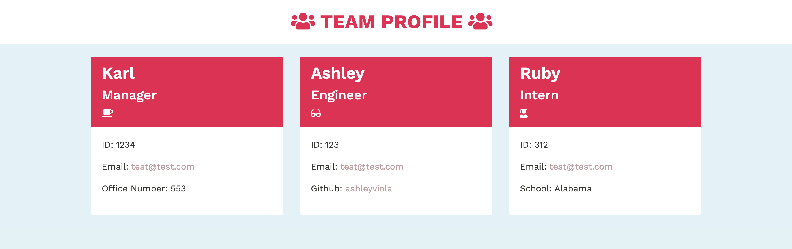

# Team Profile Generator - Homework # 10 

## Project Description
Application that is designed to take in Team Member data and put together a HTML roster sheet. The manager will input their data and then choose whether to add an engineer or an intern. 

## Built With 
- JavaScript 
- HTML 
- CSS 
- Node JS
- Inquirer 
- Jest 

### Files & Directories 
- index.js
- dist 
 - index.html
 - styl.css
- lib 
 - Employee.js
 - Engineer.js
 - Intern.js
 - Manager.js 
- src 
 - generateHTML.js
-__tests__
 - Employee.test.js
 - Engineer.test.js
 - Intern.test.js
 - Manager.test.js 

## Example of Functionality 

## Instructions 
1. Fork and clone repository
2. Create directory under /develop
3. Add static content to /develop
4. Commit changes to repository
5. Deploy repository to hosting service

## Instructions 
Created and maintained by Ashley Viola 